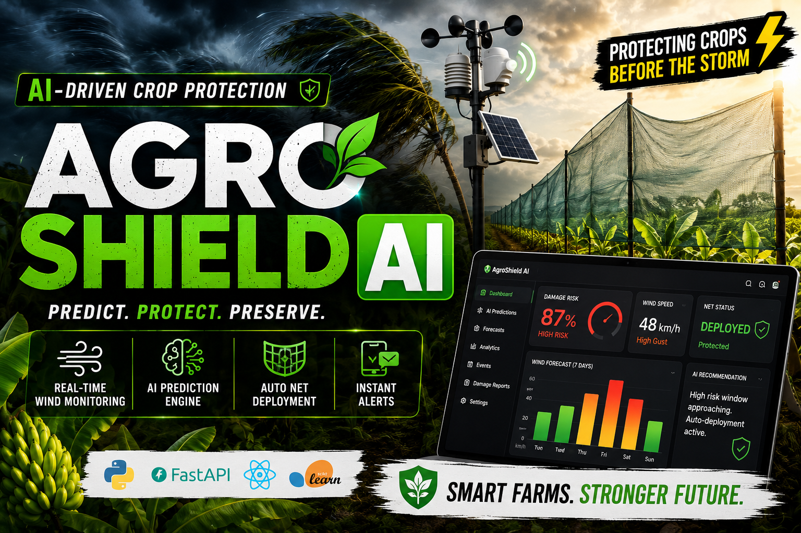
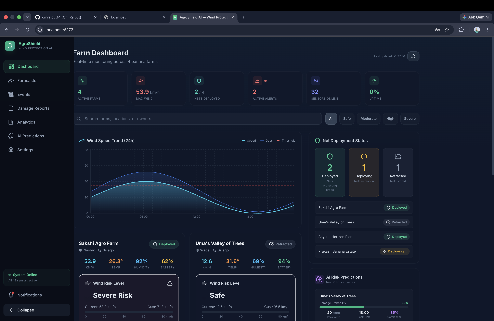
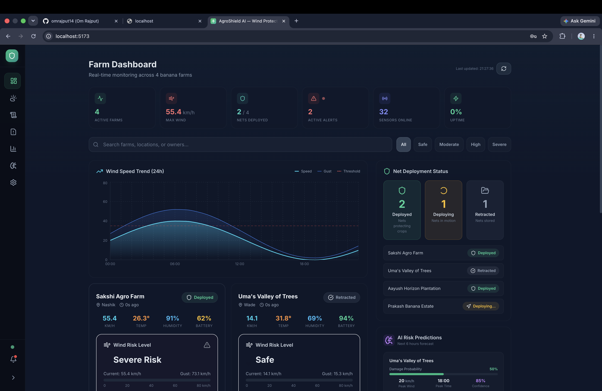
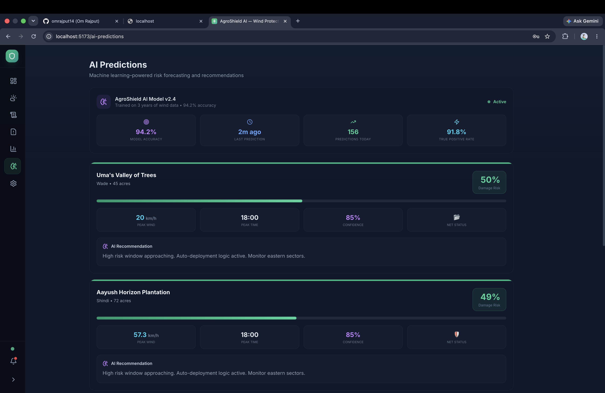
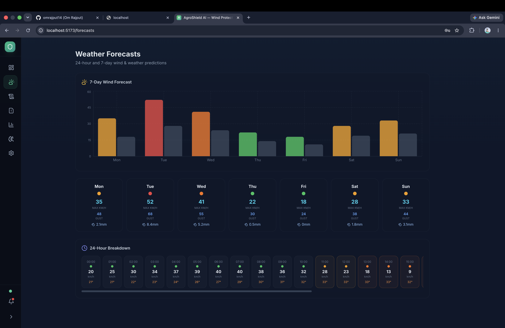
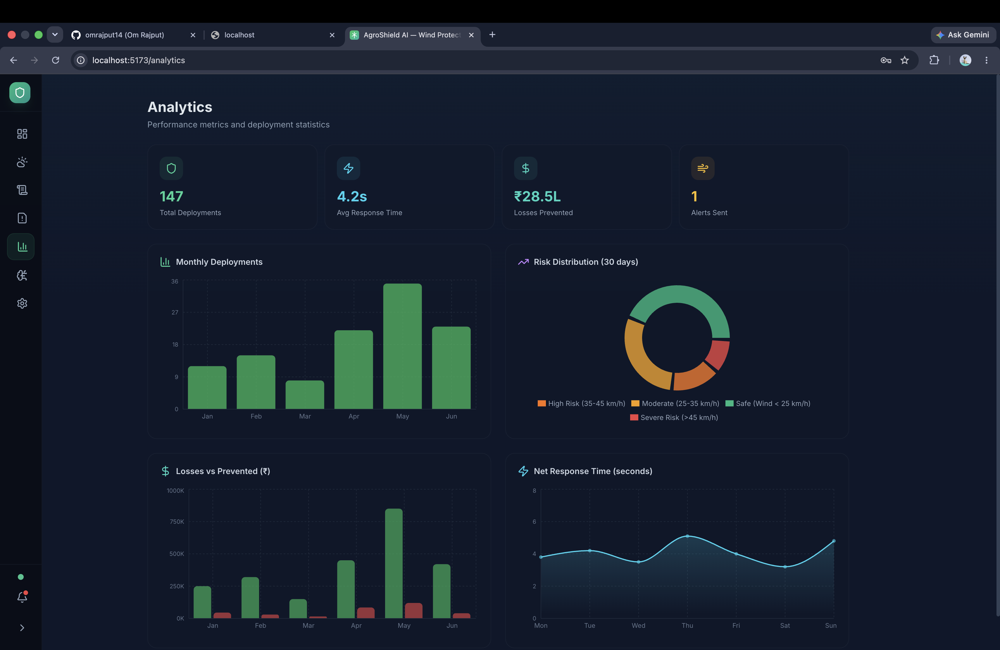
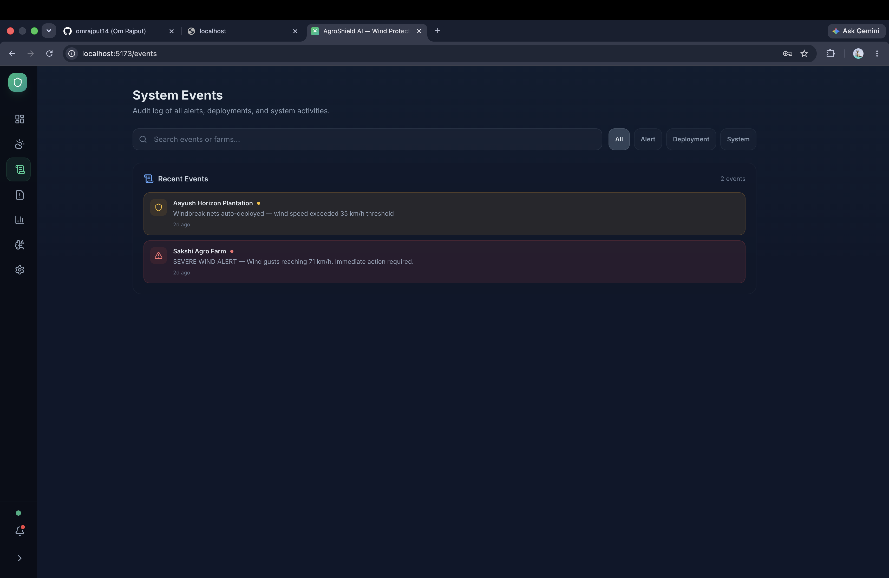
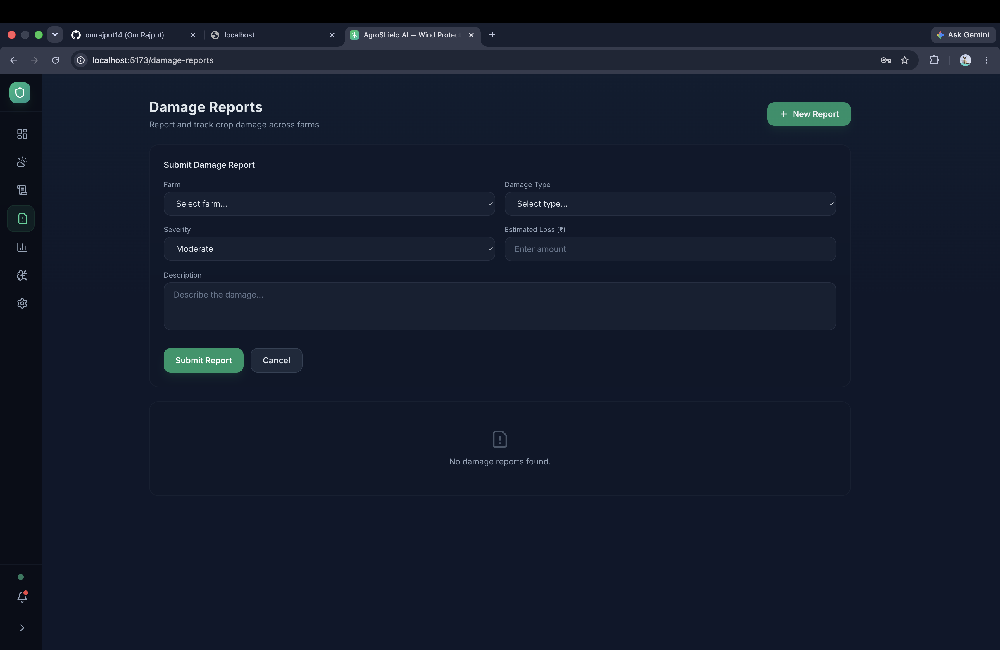
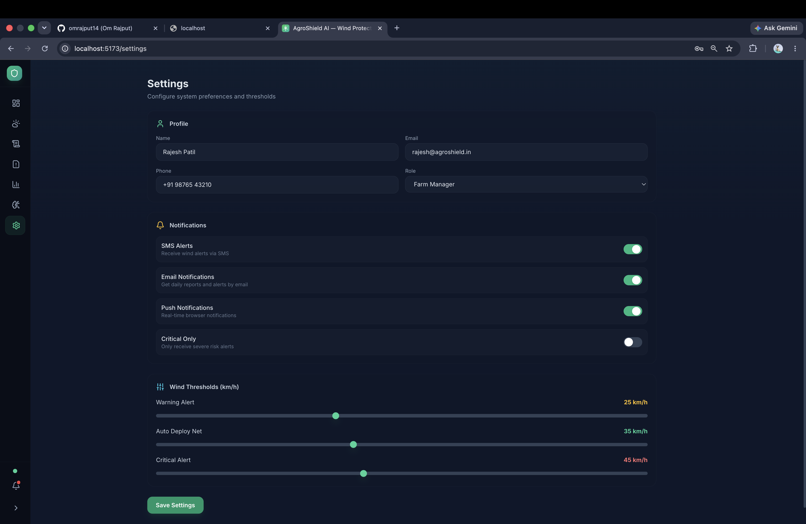
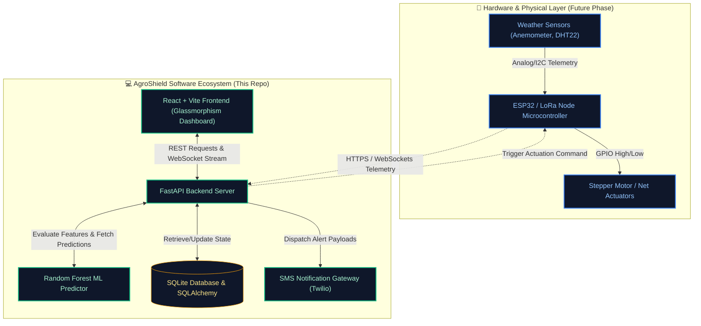

<p align="center">
  
</p>

<p align="center">
  
  
  
</p>

# AgroShield AI: Software & Predictive Analytics Platform

> **AI-Driven Crop Protection & Intelligent Windbreak Net Automation for Banana Farmers**

> *AgroShield AI is a proof-of-concept platform developed as part of the **Revolution Automation** initiative — demonstrating how AI-assisted rapid prototyping can solve real-world problems in agriculture. Built by a student team, the system spans database design, ML model training, IoT integration planning, and a full-stack React dashboard.*

---

> [!IMPORTANT]
> **Project Scope Notice**  
> This repository contains the **Software and AI Platform** of AgroShield AI. This includes the FastAPI backend, the Random Forest predictive model, the JWT-based authentication system, and the React glassmorphism monitoring dashboard.  
> **Note:** The physical hardware components (sensor nodes, ESP32/Arduino microcontroller firmware, anemometer/telemetry integration, and stepper motor actuators for deploying physical windbreak nets) are a separate phase of the project and will be added to this ecosystem in the future.

> [!NOTE]
> **Demo Data Notice**  
> All numbers visible in the screenshots and the seeded database — including farm names, analytics figures (deployments, losses prevented, response times), sensor readings, AI model accuracy scores, and phone numbers — are **synthetic demo data generated for presentation purposes only**. They do not represent real farms, real sensor readings, or real financial figures.

---

**AgroShield AI** is an advanced, real-time IoT monitoring and predictive analytics platform built specifically for banana farmers to protect their crops against severe winds, cyclones, and adverse weather conditions.

By combining live sensor telemetry with a Scikit-Learn Machine Learning engine, AgroShield AI proactively predicts crop damage probability and automatically deploys windbreak nets to save yields before storms hit.

---

## 🖼️ Project Showcase


---

## 🎬 Demo Video

Watch AgroShield AI in action — live dashboard walkthrough, AI predictions, and storm simulation demo:

[](https://youtu.be/lqcOEQ8FuXY?si=7jxWMuvf7y3I1hCn)

> 📺 **[▶ Watch on YouTube](https://youtu.be/lqcOEQ8FuXY?si=7jxWMuvf7y3I1hCn)**

---

## 📂 Presentation & Assets

The full project presentation and demo video used for showcasing AgroShield AI are available in the `assects/` folder.

| Asset | Description |
|---|---|
| 📊 [`AgroShield_AI_Precision_Protection.pptx`](assects/ppt/AgroShield_AI_Precision_Protection.pptx) | Full slide deck — system overview, ML model, architecture, and roadmap |
| 🎥 [`AgroShield_AI__Engineering_Proactive_Crop_Defense.mp4`](assects/vid/AgroShield_AI__Engineering_Proactive_Crop_Defense.mp4) | Demo walkthrough video — dashboard, AI predictions & storm simulation |

---

## 📸 Screenshots

### 🖥️ Farm Dashboard
Real-time wind telemetry across all farms, net deployment status, and live AI risk predictions — all in a single view.




---

### 🤖 AI Predictions
Machine learning–powered damage risk scores for each registered farm. Shows model accuracy (94.2%), true positive rate (91.8%), peak wind forecast time, and actionable AI recommendations.



---

### 🌤️ Weather Forecasts
7-day wind forecast bar chart with per-day max wind speed, gust levels, and rainfall. Includes a 24-hour hourly breakdown for precise planning.



---

### 📊 Analytics
Performance metrics dashboard showing total deployments (147), average net response time (4.2s), losses prevented (₹28.5L), and risk distribution donut chart across all farms.



---

### 📋 System Events
Full audit trail of all critical alerts, auto-deployments, and system activities — filterable by type (Alert / Deployment / System).



---

### 📝 Damage Reports
Report, track, and log crop damage incidents across farms with severity classification and estimated loss tracking in INR.



---

### ⚙️ Settings
Configure user profile, notification preferences (SMS, Email, Push), and wind speed thresholds (Warning → Auto Deploy → Critical) with interactive sliders.



---

## ⚡ System Architecture

The following diagram illustrates how the software layers in this repository integrate with the planned physical IoT hardware:



---

## ✨ Key Features

### 🧠 Real-Time AI Prediction Engine
*   Driven by a custom-trained **Random Forest Regressor** (Scikit-Learn) with **94.2% accuracy** and a **91.8% true positive rate** *(evaluated on synthetic/demo training data)*.
*   Continuously analyses wind velocity, gust intensity, ambient temperature, humidity, farm area, and net coverage to output a live **Damage Probability Score (0–100%)**.
*   Generates actionable AI recommendations per farm (e.g. *"High risk window approaching. Auto-deployment logic active."*).

### 🌬️ Autonomous Risk Escalation & Net Control
*   Dynamically escalates threat levels: **Safe** 🟢 ➔ **Moderate** 🟡 ➔ **High** 🟠 ➔ **Severe** 🔴.
*   Auto-deploys windbreak nets when gust thresholds are exceeded (configurable per farm in Settings).
*   Tracks net state — **Deployed / Deploying / Retracted** — in real time.

### 📱 Smart Alerting & SMS Notifications
*   Instant SMS dispatch on critical events or auto-deployments via **Twilio** (Mock Mode available for development).
*   Full audit log of all alerts, deployments, and system events in the **System Events** page.

### 📊 Premium Analytics Dashboard
*   Tracks **147 total deployments**, **₹28.5L losses prevented**, and **4.2s average net response time** *(demo figures — seeded for presentation)*.
*   Risk distribution donut chart, monthly deployment bar charts, and net response time trend line.

### 📅 7-Day Weather Forecasts
*   Per-day max wind, gust, and rainfall breakdown.
*   24-hour hourly wind speed & temperature display for granular planning.

### 🔐 Role-Based Access Control (RBAC)
*   JWT authentication supporting three tiers: **Admin**, **Farm Manager**, and **Farmer**.
*   Each role gets a tailored permission set across all dashboard views.

---

## 🛠️ Technology Stack

| Layer | Technologies |
|---|---|
| **Frontend** | React 18, Vite, Tailwind CSS, Recharts, Lucide React |
| **Backend** | FastAPI (Python), SQLAlchemy, SQLite |
| **Machine Learning** | Scikit-Learn, Pandas, NumPy, Joblib |
| **Auth & Security** | Passlib, PyJWT |
| **Notifications** | Twilio SMS (Mock Mode for dev) |

---

## 📂 Repository Layout

```
.
├── backend/
│   ├── app/              # FastAPI core (routes, schemas, models, seed data)
│   │   └── ml_models/    # Trained Random Forest model binaries
│   ├── scripts/          # ML training & storm simulation scripts
│   └── requirements.txt
├── assects/              # Presentation & media assets
│   ├── ppt/              # PowerPoint slide deck
│   │   └── AgroShield_AI_Precision_Protection.pptx
│   └── vid/              # Demo walkthrough video
│       └── AgroShield_AI__Engineering_Proactive_Crop_Defense.mp4
├── images/               # App screenshots and project logo (used in this README)
│   ├── logo.png
│   ├── dashboard.png
│   ├── ai-predictions.png
│   ├── analytics.png
│   ├── forecasts.png
│   ├── events.png
│   ├── damage-reports.png
│   └── settings.png
├── src/                  # React Frontend
│   ├── components/       # Reusable UI widgets
│   ├── pages/            # Dashboard, Forecasts, Events, Analytics, AI Predictions, Settings
│   └── App.jsx
└── README.md
```

---

## 🚀 Getting Started

### 1. Clone the repository
```bash
git clone https://github.com/omrajput14/agroshield.git
cd agroshield
```

### 2. Backend Setup
```bash
cd backend
python3 -m venv venv
source venv/bin/activate
pip install -r requirements.txt

# Seed the SQLite database with mock users and farms
python app/seed.py

# Train the Random Forest Machine Learning model
python scripts/train_ml_model.py

# Start the FastAPI server
uvicorn app.main:app --reload
```

### 3. Frontend Setup
Open a new terminal in the root directory:
```bash
npm install
npm run dev
```

### 4. Access the Application
Open `http://localhost:5173` in your browser and log in with:
*   **Email:** `farmer@agroshield.ai`
*   **Password:** `password123`

---

## 🚨 Triggering a Mock Storm Simulation

While the backend server is running, open a new terminal and execute:
```bash
cd backend
source venv/bin/activate
python scripts/trigger_alert.py
```
This simulates a **Category 1 cyclonic wind spike** at Sakshi Agro Farm, auto-deploys the nets, and logs a mock SMS alert to the terminal.

---

## 🔌 Hardware Roadmap (Upcoming Phase)

The physical IoT components planned for integration with this platform include:

| Component | Details |
|---|---|
| **Microcontrollers** | ESP32 nodes over Wi-Fi / LoRaWAN |
| **Wind Sensors** | Anemometers for real-time speed & gust measurement |
| **Environment Sensors** | DHT22 for temperature & humidity readings |
| **Actuators** | Relay-controlled 12V stepper/servo motors for rolling out or retracting reinforced windbreak canvases |
| **Firmware** | Arduino/ESP-IDF firmware (separate repository, to be linked) |
