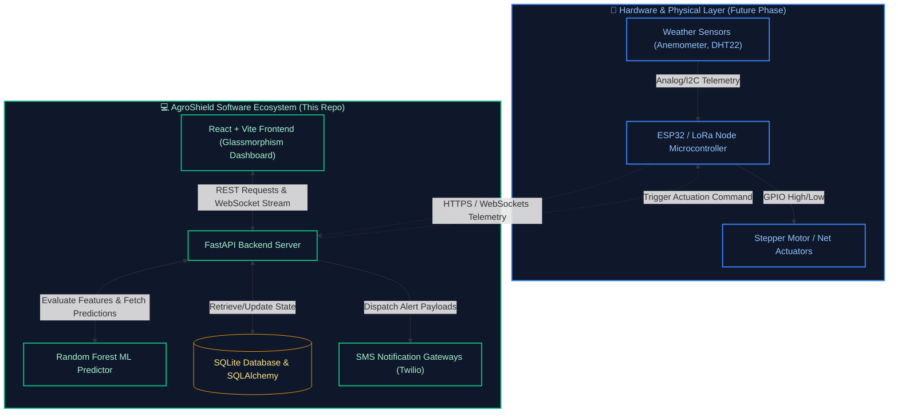

# 🌪️ AgroShield AI: Software & Predictive Analytics Platform

> **AI-Driven Crop Protection & Intelligent Windbreak Net Automation for Banana Farmers**

---

> [!IMPORTANT]
> **Project Scope Notice**  
> This repository contains the **Software and AI Platform** of AgroShield AI. This includes the FastAPI backend, the Random Forest predictive model, the JWT-based authentication system, and the React glassmorphism monitoring dashboard.  
> **Note:** The physical hardware components (sensor nodes, ESP32/Arduino microcontroller firmware, anemometer/telemetry integration, and stepper motor actuators for deploying physical windbreak nets) are a separate phase of the project and will be added to this ecosystem in the future.

---

**AgroShield AI** is an advanced, real-time IoT monitoring and predictive analytics platform built specifically for banana farmers to protect their crops against severe winds, cyclones, and adverse weather conditions. 

By combining live sensor telemetry with a Scikit-Learn Machine Learning engine, AgroShield AI proactively predicts crop damage probability and automatically deploys windbreak nets to save yields before storms hit.

 *(Replace with actual dashboard screenshot)*

---

## ⚡ System Architecture

The following diagram illustrates how the software layers in this repository integrate with the planned physical IoT hardware:



---

## ✨ Key Features

### 🧠 Real-Time AI Prediction Engine
*   **Predictive Model:** Driven by a custom-trained **Random Forest Regressor** Machine Learning model (built on Scikit-Learn).
*   **Dynamic Risk Evaluation:** Continually analyzes real-time weather indicators—including wind velocity, gust intensity, ambient temperature, relative humidity—against historic storm patterns and current physical parameters (such as the farm's surface area and net deployment coverage).
*   **Damage Prediction:** Yields a high-precision, real-time **Damage Probability Score** (0-100%) to guide crop-saving decisions.

### 🌬️ Autonomous Mitigation & Risk Escalation
*   **Automatic Deployment:** Once wind speeds exceed predefined safety thresholds, the platform transitions state to alert the farm and triggers a virtual signal to deploy physical windbreak nets immediately.
*   **State Machine:** Dynamically escalates threat levels across **Safe** 🟢 ➔ **Moderate** 🟡 ➔ **High** 🟠 ➔ **Severe** 🔴 based on live weather data feeds.

### 📱 Smart Alerting & Notification Dispatcher
*   **Instant Notifications:** Integrates a responsive alerting queue that sends simulated or live SMS notifications to the farmer when critical status changes occur or automated actions are taken.
*   **Production Ready:** Features a mock SMS dispatcher for debugging, ready to transition to **Twilio** APIs with minimal configuration.

### 📊 Premium Glassmorphism UI/UX
*   **Modern Aesthetics:** Designed with a striking dark-theme glassmorphism interface using **Tailwind CSS**.
*   **Live Simulation:** Incorporates realistic telemetry generation (using slight jitter/fluctuations) to simulate continuous IoT sensor streaming.
*   **Interactive Visualization:** Displays historical patterns and real-time trends using dynamic, fully responsive **Recharts** configurations.

### 🔐 Multi-Tier Access Control (RBAC)
*   **Security:** Leverages robust, state-of-the-art JWT-based authorization tokens.
*   **User Roles:** Supports distinct permission dashboards for **Admins** (system configuration), **Farm Managers** (operational thresholds), and **Farmers** (daily telemetry & views).

---

## 🛠️ Technology Stack

*   **Frontend:** React 18 (Vite, Tailwind CSS, Recharts for analytics data-visualization, Lucide React icons).
*   **Backend:** FastAPI (Python), SQLAlchemy + SQLite database core, Passlib & PyJWT (Auth & Security).
*   **Machine Learning:** Scikit-Learn, Pandas, NumPy, Joblib (model compilation and prediction pipelining).

---

## 📂 Repository Layout

```
.
├── backend/                  # FastAPI Application, database configuration, ML assets & scripts
│   ├── app/                  # Application core code (endpoints, schemas, models, seed)
│   ├── scripts/              # ML training and automated alert simulation scripts
│   └── requirements.txt      # Python dependencies
├── src/                      # React Frontend Source Code
│   ├── components/           # Reusable UI components & widget elements
│   ├── pages/                # App views (Dashboard, Predictions, Analytics, Settings, etc.)
│   ├── context/              # Authentication & global application state hooks
│   └── App.jsx               # Client application routing configurations
└── README.md                 # Project Overview & Setup Instructions (This File)
```

---

## 🚀 Getting Started

### 1. Clone the repository
```bash
git clone https://github.com/omrajput14/agroshield.git
cd agroshield
```

### 2. Backend Setup
Navigate to the `backend` directory, create a virtual environment, install the backend libraries, seed the local database, and generate the model binaries.
```bash
cd backend
python3 -m venv venv
source venv/bin/activate
pip install -r requirements.txt

# Seed the SQLite database with mock users and farms
python app/seed.py

# Train the Random Forest Machine Learning model
python scripts/train_ml_model.py

# Start the FastAPI server
uvicorn app.main:app --reload
```

### 3. Frontend Setup
Open a new terminal and navigate to the root directory to launch the Vite development server.
```bash
npm install
npm run dev
```

### 4. Access the Application
Open your browser and navigate to `http://localhost:5173`. 
Log in with the default seeded mock credentials:
*   **Email:** `farmer@agroshield.ai`
*   **Password:** `password123`

---

## 🚨 Triggering a Mock Storm Simulation

Want to see the auto-deployment and SMS notification system in action? While the backend server is running, open a new terminal and run:
```bash
cd backend
source venv/bin/activate
python scripts/trigger_alert.py
```
This will simulate a Category 1 cyclonic wind spike at **Sakshi Agro Farm**, auto-deploy the nets, and dispatch a mock SMS log to the terminal.

---

## 🔌 Hardware Roadmap (Upcoming Phase)

The physical IoT components planned for integration with this dashboard include:
*   **Microcontrollers:** ESP32 nodes connected over Wi-Fi / LoRaWAN.
*   **Sensors:** Anemometers (wind speed), DHT22 (temperature and humidity), and soil moisture sensors.
*   **Actuators:** Relay-controlled 12V stepper/servo motors to dynamically roll out or retract reinforced windbreak canvases.
